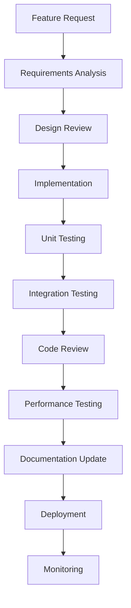
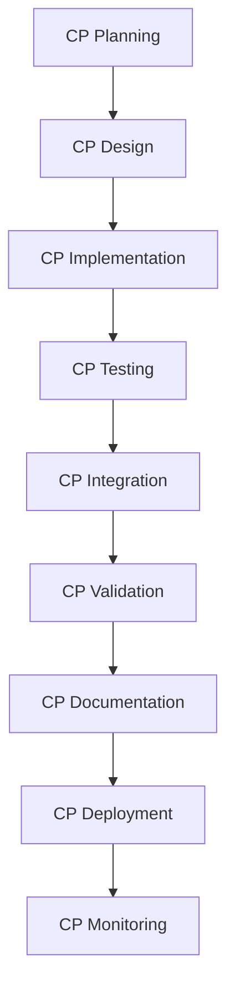
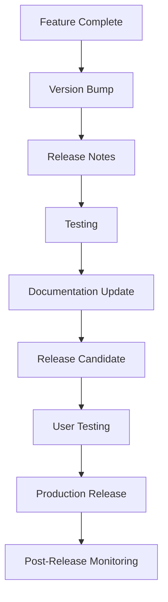

# Development Workflows

## 🔄 Overview

The NepaliGov-RAG-Bench project follows structured development workflows that ensure code quality, system reliability, and continuous improvement. This document outlines the key workflows used throughout the project lifecycle.

## 📋 Development Workflow

### 1. Feature Development Workflow



#### Steps:
1. **Requirements Analysis**: Understand feature requirements and constraints
2. **Design Review**: Create technical design and get team approval
3. **Implementation**: Develop feature following coding standards
4. **Unit Testing**: Write and run unit tests
5. **Integration Testing**: Test feature integration with existing system
6. **Code Review**: Peer review of code changes
7. **Performance Testing**: Ensure feature meets performance requirements
8. **Documentation Update**: Update relevant documentation
9. **Deployment**: Deploy to staging/production environment
10. **Monitoring**: Monitor feature performance and user feedback

### 2. Checkpoint Development Workflow



#### CP Development Process:
1. **Planning**: Define CP objectives and success criteria
2. **Design**: Create detailed technical design
3. **Implementation**: Develop CP components
4. **Testing**: Comprehensive testing of CP functionality
5. **Integration**: Integrate with existing checkpoints
6. **Validation**: Validate CP meets requirements
7. **Documentation**: Document CP functionality and usage
8. **Deployment**: Deploy CP to production
9. **Monitoring**: Monitor CP performance and impact

## 🧪 Testing Workflows

### 1. Unit Testing Workflow

```python
# Example unit test structure
import unittest
from src.cp3.ocr_processor import OCRProcessor

class TestOCRProcessor(unittest.TestCase):
    def setUp(self):
        self.ocr_processor = OCRProcessor()
    
    def test_text_extraction(self):
        # Test normal text extraction
        result = self.ocr_processor.extract_text("sample.pdf")
        self.assertIsNotNone(result['text'])
        self.assertGreater(result['confidence'], 0.8)
    
    def test_poor_quality_document(self):
        # Test fallback OCR
        result = self.ocr_processor.extract_text("poor_quality.pdf")
        self.assertIsNotNone(result['text'])
        self.assertTrue(result['used_fallback'])
```

### 2. Integration Testing Workflow

```python
# Example integration test
class TestDocumentProcessingPipeline(unittest.TestCase):
    def test_full_pipeline(self):
        # Test complete document processing pipeline
        document = "test_document.pdf"
        
        # CP1: Authority Detection
        authority = self.authority_detector.detect(document)
        self.assertTrue(authority['is_valid'])
        
        # CP2: Document Classification
        doc_type = self.type_classifier.classify(document)
        self.assertIn(doc_type['type'], ['policy', 'report', 'form'])
        
        # CP3: OCR Processing
        ocr_result = self.ocr_processor.process(document)
        self.assertGreater(ocr_result['quality_score'], 0.7)
        
        # CP4: Vector Storage
        embedding = self.vector_storage.create_embedding(ocr_result['text'])
        self.assertIsNotNone(embedding)
```

### 3. Performance Testing Workflow

```python
# Example performance test
import time
import concurrent.futures

class TestPerformance(unittest.TestCase):
    def test_query_response_time(self):
        # Test query response time under load
        queries = ["What are business requirements?"] * 100
        
        start_time = time.time()
        
        with concurrent.futures.ThreadPoolExecutor(max_workers=10) as executor:
            futures = [executor.submit(self.search_engine.search, query) 
                      for query in queries]
            
            results = [future.result() for future in futures]
        
        end_time = time.time()
        avg_response_time = (end_time - start_time) / len(queries)
        
        self.assertLess(avg_response_time, 2.0)  # Should be under 2 seconds
```

## 🔄 CI/CD Workflow

### 1. Continuous Integration Pipeline

```yaml
# .github/workflows/ci.yml
name: CI/CD Pipeline

on:
  push:
    branches: [ main, develop ]
  pull_request:
    branches: [ main ]

jobs:
  test:
    runs-on: ubuntu-latest
    steps:
    - uses: actions/checkout@v2
    
    - name: Set up Python
      uses: actions/setup-python@v2
      with:
        python-version: 3.12
    
    - name: Install dependencies
      run: |
        python -m pip install --upgrade pip
        pip install -r requirements.txt
        pip install -r requirements-dev.txt
    
    - name: Run unit tests
      run: pytest tests/unit/
    
    - name: Run integration tests
      run: pytest tests/integration/
    
    - name: Run performance tests
      run: pytest tests/performance/
    
    - name: Generate coverage report
      run: pytest --cov=src tests/
    
    - name: Upload coverage to Codecov
      uses: codecov/codecov-action@v1
```

### 2. Deployment Workflow

```yaml
# .github/workflows/deploy.yml
name: Deploy

on:
  push:
    branches: [ main ]

jobs:
  deploy:
    runs-on: ubuntu-latest
    steps:
    - uses: actions/checkout@v2
    
    - name: Build Docker image
      run: docker build -t nepaligov-rag-bench .
    
    - name: Deploy to staging
      run: |
        docker tag nepaligov-rag-bench:latest $STAGING_REGISTRY/nepaligov-rag-bench:latest
        docker push $STAGING_REGISTRY/nepaligov-rag-bench:latest
    
    - name: Run smoke tests
      run: pytest tests/smoke/
    
    - name: Deploy to production
      if: success()
      run: |
        docker tag nepaligov-rag-bench:latest $PROD_REGISTRY/nepaligov-rag-bench:latest
        docker push $PROD_REGISTRY/nepaligov-rag-bench:latest
```

## 📊 Quality Assurance Workflow

### 1. Code Quality Workflow

```python
# Pre-commit hooks configuration
# .pre-commit-config.yaml
repos:
  - repo: https://github.com/psf/black
    rev: 22.3.0
    hooks:
      - id: black
        language_version: python3.12

  - repo: https://github.com/pycqa/flake8
    rev: 4.0.1
    hooks:
      - id: flake8
        args: [--max-line-length=88, --extend-ignore=E203]

  - repo: https://github.com/pycqa/isort
    rev: 5.10.1
    hooks:
      - id: isort
        args: [--profile=black]

  - repo: https://github.com/pre-commit/mirrors-mypy
    rev: v0.950
    hooks:
      - id: mypy
        additional_dependencies: [types-requests]
```

### 2. Security Scanning Workflow

```yaml
# Security scanning workflow
name: Security Scan

on:
  schedule:
    - cron: '0 2 * * 1'  # Weekly on Monday at 2 AM
  push:
    branches: [ main ]

jobs:
  security:
    runs-on: ubuntu-latest
    steps:
    - uses: actions/checkout@v2
    
    - name: Run Bandit security scan
      run: bandit -r src/
    
    - name: Run Safety dependency scan
      run: safety check
    
    - name: Run Trivy vulnerability scan
      uses: aquasecurity/trivy-action@master
      with:
        scan-type: 'fs'
        scan-ref: '.'
        format: 'sarif'
        output: 'trivy-results.sarif'
```

## 🔍 Monitoring Workflow

### 1. Performance Monitoring

```python
# Performance monitoring setup
import time
import logging
from functools import wraps

def monitor_performance(func):
    @wraps(func)
    def wrapper(*args, **kwargs):
        start_time = time.time()
        try:
            result = func(*args, **kwargs)
            execution_time = time.time() - start_time
            
            # Log performance metrics
            logging.info(f"{func.__name__} executed in {execution_time:.2f}s")
            
            # Send metrics to monitoring system
            send_metric(f"{func.__name__}_duration", execution_time)
            
            return result
        except Exception as e:
            execution_time = time.time() - start_time
            logging.error(f"{func.__name__} failed after {execution_time:.2f}s: {e}")
            send_metric(f"{func.__name__}_errors", 1)
            raise
    
    return wrapper

# Usage example
@monitor_performance
def process_document(document_path):
    # Document processing logic
    pass
```

### 2. Error Tracking Workflow

```python
# Error tracking setup
import sentry_sdk
from sentry_sdk.integrations.flask import FlaskIntegration

def setup_error_tracking():
    sentry_sdk.init(
        dsn="YOUR_SENTRY_DSN",
        integrations=[FlaskIntegration()],
        traces_sample_rate=0.1,
        environment="production"
    )

# Custom error handling
@app.errorhandler(Exception)
def handle_exception(e):
    # Log error
    logging.error(f"Unhandled exception: {e}")
    
    # Send to error tracking
    sentry_sdk.capture_exception(e)
    
    # Return user-friendly error
    return jsonify({
        'error': 'Internal server error',
        'message': 'An unexpected error occurred'
    }), 500
```

## 📚 Documentation Workflow

### 1. Documentation Standards

- **API Documentation**: Automatically generated from code comments
- **User Documentation**: Written in Markdown with clear examples
- **Technical Documentation**: Detailed technical specifications
- **Code Comments**: Inline comments for complex logic

### 2. Documentation Generation

```python
# API documentation generation
from flask_restx import Api, Resource, fields

api = Api(app, doc='/docs/', title='NepaliGov-RAG-Bench API')

# Define API models
search_model = api.model('Search', {
    'query': fields.String(required=True, description='Search query'),
    'language': fields.String(description='Query language'),
    'max_results': fields.Integer(description='Maximum results to return')
})

# Define API endpoints
@api.route('/search')
class Search(Resource):
    @api.expect(search_model)
    @api.marshal_with(search_result_model)
    def post(self):
        """Search documents using semantic search"""
        pass
```

## 🔄 Release Workflow

### 1. Release Process



### 2. Version Management

```python
# Version management
# setup.py
from setuptools import setup

setup(
    name="nepaligov-rag-bench",
    version="1.2.0",
    description="Nepali Government RAG System",
    # ... other configuration
)

# Version checking in code
import pkg_resources

def get_version():
    return pkg_resources.get_distribution("nepaligov-rag-bench").version

def check_version_compatibility():
    current_version = get_version()
    # Version compatibility logic
    pass
```

## 🎯 Best Practices

### 1. Code Quality
- **Consistent Style**: Follow PEP 8 and project style guide
- **Type Hints**: Use type hints for better code clarity
- **Error Handling**: Comprehensive error handling with logging
- **Testing**: Maintain high test coverage (>80%)

### 2. Performance
- **Profiling**: Regular performance profiling and optimization
- **Caching**: Strategic caching of expensive operations
- **Resource Management**: Efficient resource utilization
- **Monitoring**: Continuous performance monitoring

### 3. Security
- **Input Validation**: Validate all user inputs
- **Authentication**: Secure authentication and authorization
- **Data Protection**: Encrypt sensitive data
- **Regular Updates**: Keep dependencies updated

### 4. Documentation
- **Clear Comments**: Clear, concise code comments
- **API Documentation**: Comprehensive API documentation
- **User Guides**: Step-by-step user guides
- **Technical Specs**: Detailed technical specifications

---

**Next**: Explore [Testing Guide](testing.md) or [Contributing Guidelines](contributing.md).
