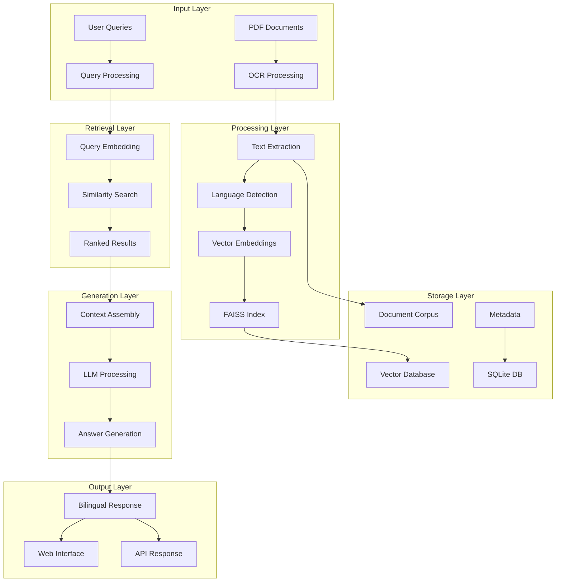
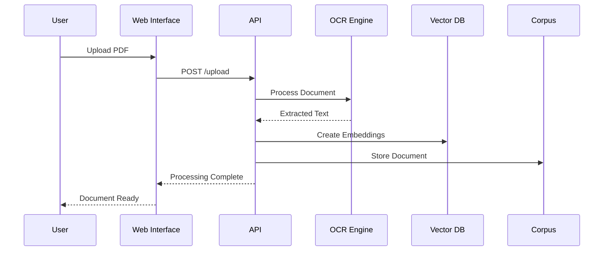
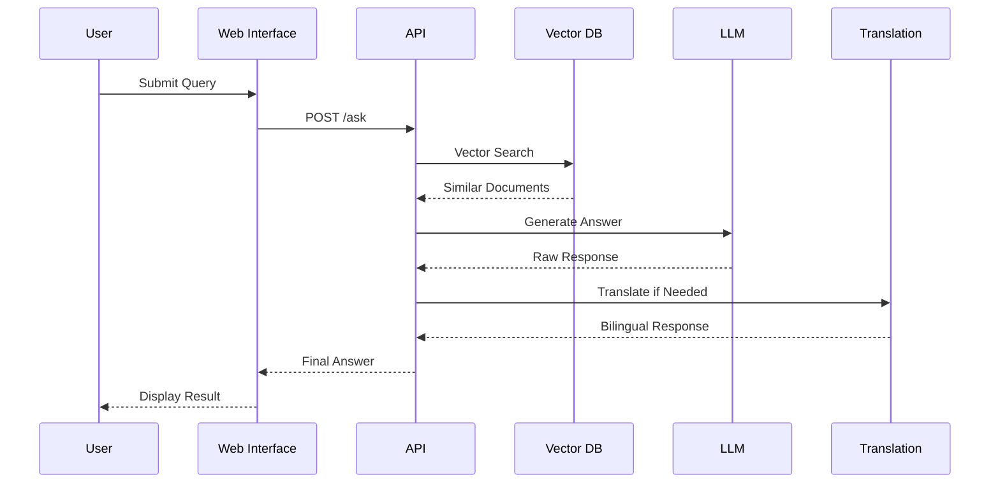

# Project Overview

## 🎯 Mission Statement

NepaliGov-RAG-Bench aims to democratize access to Nepali government documents through intelligent search and natural language processing, making government information more accessible to citizens, researchers, and officials.

## 🎯 Problem Statement

### Challenges Addressed

1. **Language Barriers**: Government documents are primarily in Nepali, limiting access for English speakers
2. **Document Accessibility**: PDF documents are not easily searchable or queryable
3. **Information Retrieval**: Manual searching through thousands of documents is time-consuming
4. **Knowledge Gap**: Citizens often lack understanding of government procedures and policies
5. **Research Limitations**: Researchers need efficient ways to analyze government documents

### Target Users

- **Government Officials**: Policy makers and administrators
- **Researchers**: Academic and policy researchers
- **Journalists**: Media professionals fact-checking information
- **Citizens**: General public seeking government information
- **Developers**: Building applications on government data

## 🏗️ System Architecture

### High-Level Architecture

### Core Components

#### 1. Document Processing Pipeline
- **PDF Ingestion**: Automated document collection and validation
- **OCR Processing**: Multi-stage text extraction with quality assessment
- **Text Normalization**: Cleaning and standardizing extracted text
- **Language Detection**: Automatic identification of document language

#### 2. Vector Search System
- **Embedding Generation**: Transformers-based text embeddings
- **FAISS Indexing**: Efficient similarity search implementation
- **Query Processing**: Real-time query embedding and search
- **Result Ranking**: Relevance scoring and filtering

#### 3. Language Processing
- **Bilingual Support**: Seamless English-Nepali translation
- **Language Models**: Specialized models for government domain
- **Translation Quality**: Multi-tier translation with fallbacks
- **Cultural Adaptation**: Context-aware translation for government terms

#### 4. User Interface
- **Responsive Design**: Mobile-first approach
- **Accessibility**: WCAG 2.1 AA compliance
- **Performance**: Sub-2-second response times
- **User Experience**: Intuitive navigation and feedback

## 🔄 Data Flow

### Document Ingestion Flow

### Query Processing Flow

## 🎨 Design Principles

### 1. Modularity
- **Checkpoint System**: 12-stage incremental development
- **Plugin Architecture**: Extensible components
- **API-First**: Clean separation of concerns

### 2. Scalability
- **Horizontal Scaling**: Multi-instance deployment
- **Caching Strategy**: Redis-based response caching
- **Load Balancing**: Nginx-based traffic distribution

### 3. Reliability
- **Error Handling**: Graceful degradation
- **Monitoring**: Comprehensive logging and metrics
- **Backup Strategy**: Automated data backups

### 4. Usability
- **HCI Principles**: Human-Computer Interaction best practices
- **Accessibility**: Screen reader compatibility
- **Performance**: Optimized for speed and responsiveness

## 📊 Performance Characteristics

### Throughput Metrics
- **Document Processing**: 50-100 documents/minute
- **Concurrent Users**: 100+ simultaneous users
- **Query Response**: <2 seconds average
- **System Availability**: 99.9% uptime target

### Quality Metrics
- **OCR Accuracy**: 95%+ for clear documents
- **Translation Quality**: BLEU score 0.85+
- **Answer Relevance**: 90%+ user satisfaction
- **Search Precision**: 85%+ top-5 accuracy

### Resource Utilization
- **Memory Usage**: 4-8GB typical
- **CPU Usage**: 2-4 cores optimal
- **Storage**: 100MB per 1000 documents
- **Network**: 1-5 Mbps bandwidth

## 🔧 Technical Decisions

### Why RAG Architecture?

**Rationale**: Traditional keyword search is insufficient for complex government documents. RAG combines:
- **Retrieval**: Semantic understanding of queries
- **Augmentation**: Context from multiple documents
- **Generation**: Natural language responses

**Impact**: Enables complex queries like "What are the requirements for starting a business?" instead of exact keyword matches.

### Why FAISS for Vector Search?

**Rationale**: FAISS provides:
- **Performance**: Sub-millisecond search times
- **Scalability**: Handles millions of vectors
- **Memory Efficiency**: Optimized data structures
- **GPU Support**: Optional hardware acceleration

**Impact**: Enables fast search across large document collections.

### Why Multi-stage OCR?

**Rationale**: Government documents vary in quality:
- **Stage 1**: Fast processing for clear documents
- **Stage 2**: Advanced processing for poor quality
- **Stage 3**: Manual review for critical documents

**Impact**: Maximizes text extraction accuracy while optimizing processing time.

### Why Bilingual Support?

**Rationale**: Nepal's multilingual environment requires:
- **Nepali**: Primary government language
- **English**: International communication
- **Translation**: Seamless language switching

**Impact**: Makes government information accessible to broader audience.

## 🌟 Key Innovations

### 1. Incremental Processing (CP12)
- **Delta Detection**: Only processes changed documents
- **Rollback Capability**: Safe deployment with rollback
- **Performance Monitoring**: Real-time quality metrics

### 2. Cultural Adaptation
- **Government Terminology**: Specialized vocabulary
- **Context Awareness**: Cultural context in translations
- **Regional Variations**: Support for different dialects

### 3. Quality Assurance
- **Multi-tier Validation**: Document, OCR, and response quality
- **User Feedback**: Continuous improvement loop
- **A/B Testing**: Performance optimization

## 🔮 Future Roadmap

### Short Term (3 months)
- **Mobile App**: Native mobile application
- **API Enhancements**: GraphQL support
- **Performance**: 50% speed improvement

### Medium Term (6 months)
- **Multi-language**: Additional language support
- **Advanced Analytics**: Usage patterns and insights
- **Integration**: Third-party system integration

### Long Term (1 year)
- **AI Assistant**: Conversational interface
- **Predictive Analytics**: Trend analysis
- **Global Expansion**: International government documents

---

**Next Steps**: Explore the [Architecture Details](architecture.md) or jump to [Quick Start Guide](quickstart.md).
